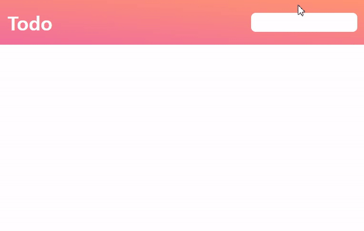

# todolist


## 기능  
to do list 

1) 할 일을 추가 (엔터 누르면 추가)
2) 할 일 기능 완료 체크
3) 좋아요 표시 
4) 할 일 삭제 

## 학습  
### 1. CSS : flex의 flex 속성
: <ins>flex-grow, flex-shrink, flex-basis</ins>를 한 번에 쓸 수 있는 축약형 속성   
```
.item {
	flex: 1;
	/* flex-grow: 1; flex-shrink: 1; flex-basis: 0%; */
	flex: 1 1 auto;
	/* flex-grow: 1; flex-shrink: 1; flex-basis: auto; */
	flex: 1 500px;
	/* flex-grow: 1; flex-shrink: 1; flex-basis: 500px; */
}
```
: <ins>주의할 점은, flex: 1; 이런 식으로 flex-basis를 생략해서 쓰면 flex-basis의 값은 0</ins>이 됩니다.

### 2. CSS : display : none과 visibility: hidden의 차이 
비교|공통점|차이점
--|--|--|
display : none|요소를 보이지 않게 하는 속성| 화면 상 어떤 영역을 차지하지 않고 완전히 삭제된 것처럼 보이게 합니다.
visibility: hidden|요소를 보이지 않게 하는 속성| 해당 요소가 보이지 않을 뿐 요소가 존재하는 영역은 확실히 보이게 됩니다.

## 학습 출처  
**<클래스 101>**     
바닐라 자바스크립트로 배우는 모던 프론트엔드 실전!

**CSS**    
https://studiomeal.com/archives/197    
https://mber.tistory.com/42       


**키워드**    
flex     
display : none   
visibility: hidden     
